# Coriolis

LED matrix wall display — successor to [Borealis](https://github.com/cyanidesayonara/borealis)
(Aurora → Borealis → Coriolis). A 128×128 HUB75 panel driven by a Teensy 4.1:
a wall clock first, with ambient art, a guided-fitness suite, and games.

Developed entirely against a desktop simulator; the images below are captured
from it. See [PLAN.md](PLAN.md) for the hardware plan and the platform decision.

## Scenes

<table>
<tr>
<td align="center">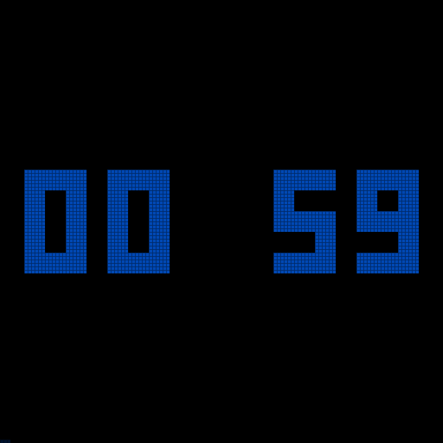<br>Digital clock</td>
<td align="center">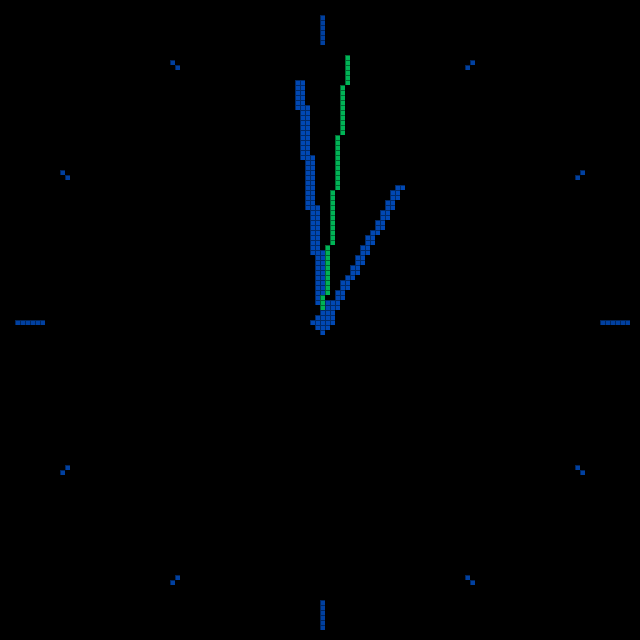<br>Analog clock</td>
<td align="center">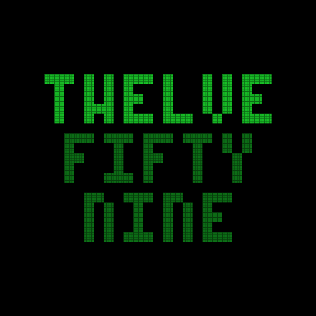<br>Word clock</td>
</tr>
<tr>
<td align="center">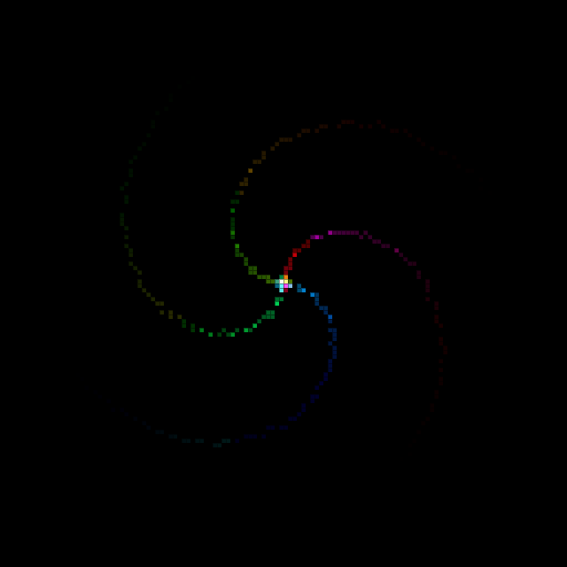<br>Spiro</td>
<td align="center">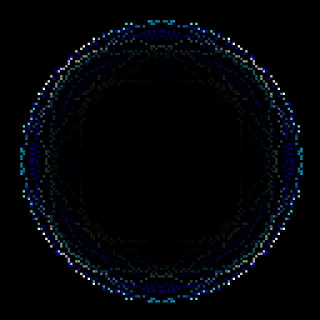<br>Mandala</td>
<td align="center">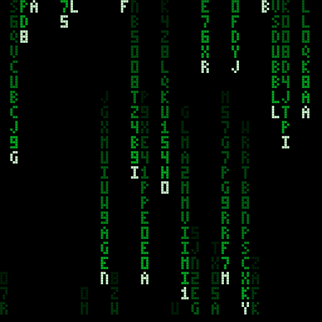<br>Digital rain</td>
</tr>
<tr>
<td align="center">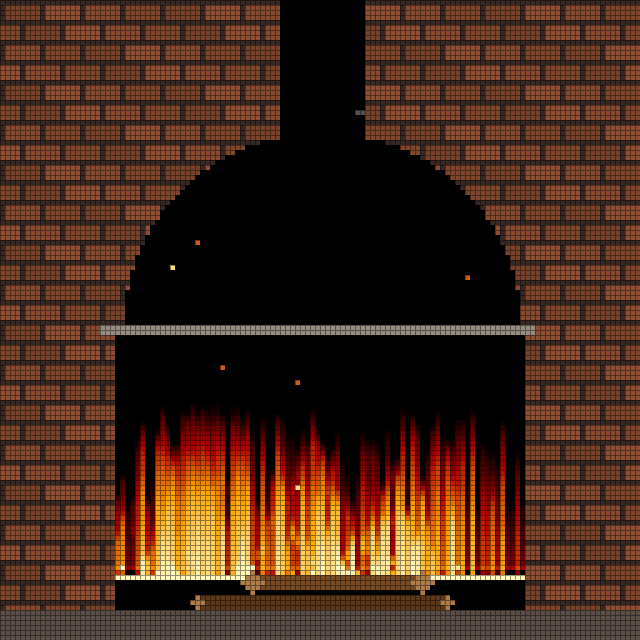<br>Fireplace</td>
<td align="center">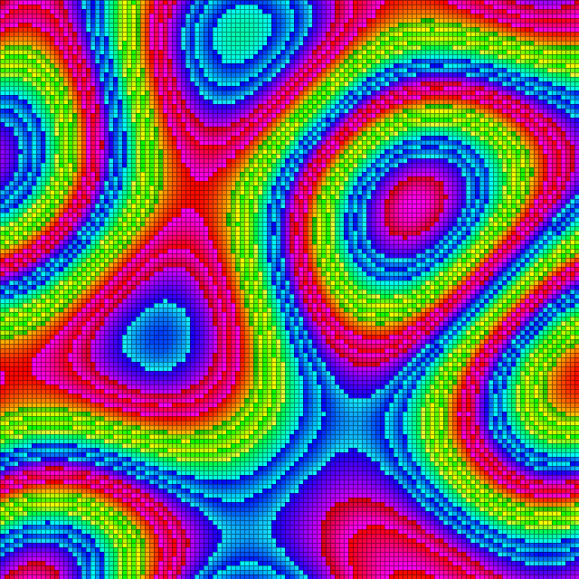<br>Plasma</td>
<td align="center">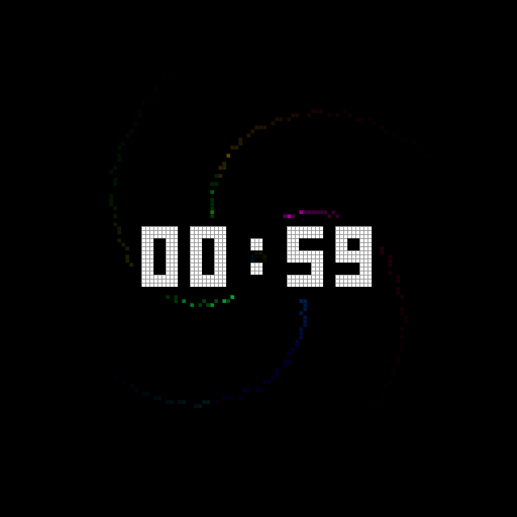<br>Clock overlay</td>
</tr>
<tr>
<td align="center">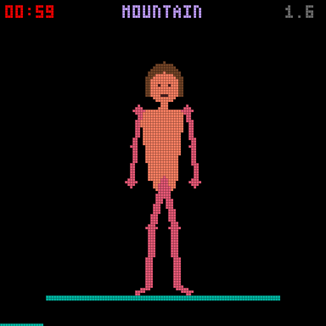<br>Yoga</td>
<td align="center">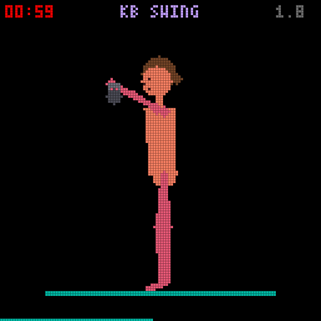<br>Exercise (kettlebell)</td>
<td align="center">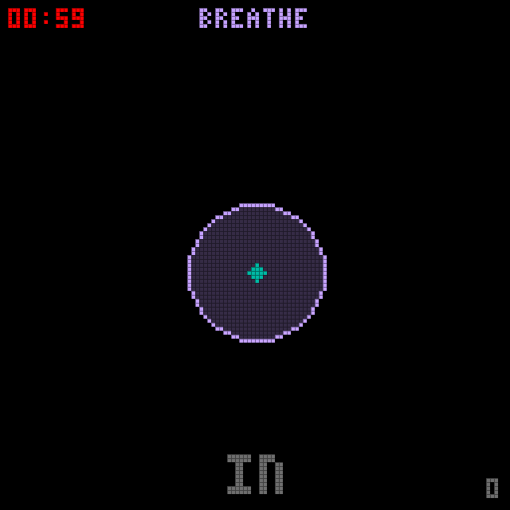<br>Breathe</td>
</tr>
<tr>
<td align="center">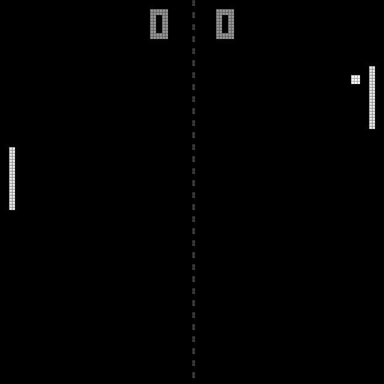<br>Pong</td>
<td align="center">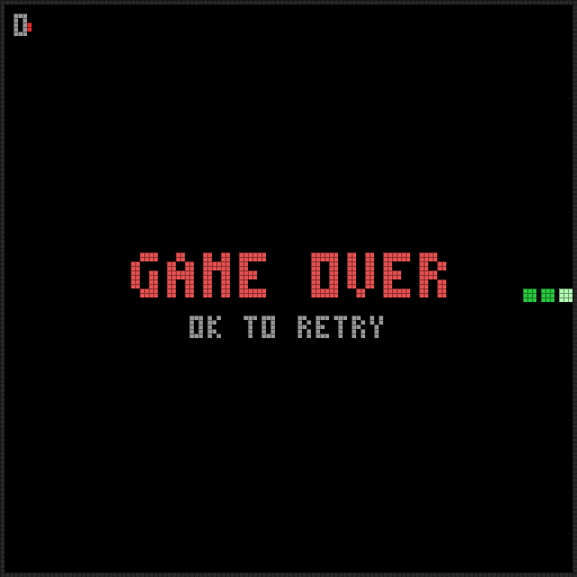<br>Snake</td>
<td align="center">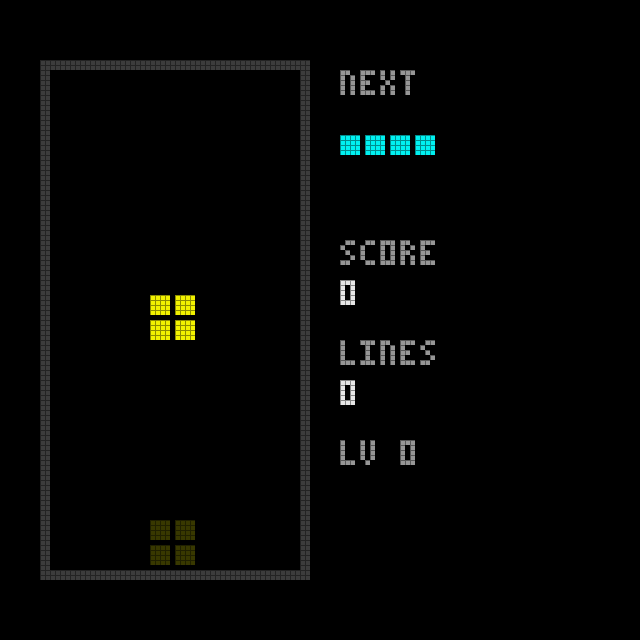<br>Tetris</td>
</tr>
</table>

Any of the three clocks can also be shown as a movable, resizable **overlay**
on top of any other scene (the `C` button), just like Borealis.

## Architecture

Scenes (clock, patterns, games) draw into a plain framebuffer through a small
core API and never touch hardware. Backends copy that framebuffer to a real
output:

```
core/     framebuffer, color, 8-bit wave math, palettes, bitmap font, Scene API
scenes/   everything visible: clock, spiro, fire, plasma, ...
sim/      desktop backend: raylib window, system clock, keyboard input
firmware/ (later) hardware backend for the chosen platform
```

The simulator is not a side tool — it's the primary development environment.
Scenes are written and tuned on the desktop; the hardware backend only
replaces the window with panels and the keyboard with a remote/gamepad.

The display is `128x128` square (the decided final form). A `128x64` widescreen
variant survives as a build flag (`-DWIDE=ON`) for experiments, so scenes stay
resolution-agnostic.

## Build and run the simulator

Prerequisites: CMake ≥ 3.16, a C++ compiler, git (raylib is fetched
automatically on first configure).

```sh
cmake -B build
cmake --build build
./build/coriolis_sim          # Windows: build\coriolis_sim.exe

# the widescreen 128x64 variant:
cmake -B build-wide -DWIDE=ON
cmake --build build-wide

# regenerate the README screenshots:
./build/coriolis_sim --shots docs/screenshots
```

## Controls (simulator)

| Key | Action |
|-----|--------|
| `SPACE` / `→` | next scene |
| `←` | previous scene |
| `↑` / `↓` | cycle palette (when the scene doesn't use them) |
| `S` | open/close settings — jumps to the current scene's section |
| `C` | cycle the clock overlay (off / digital / analog / word) |
| `BACKSPACE` | back: closes settings, otherwise home to the clock |
| `R` | rotate the display 90° |
| `ESC` | quit (saves settings) |

Each control maps to a button on the device's IR remote (`S` = menu, `C` =
the overlay button, arrows + OK + back). A USB gamepad is the optional
better input for the games.

Settings is not part of the scene rotation — only `S` reaches it (the
remote's menu button on the device). It is one scrolling list with
sections: GENERAL (brightness, palette, rotation, autoplay), OVERLAY (clock
type, position, size), then one per scene (yoga, exercise, breathe, pong,
snake, fireplace). Games are never themed; clocks and patterns follow the
palette; guides and the fireplace keep their own fixed look.

Guide scenes (`↑`/`↓` set the pace, `ENTER` pauses):
- **Yoga** holds poses; **Exercise** animates reps with a bodyweight or
  kettlebell program (settings); **Breathe** is box or 4-7-8.

Arrow keys are offered to the active scene first, matching how a
remote/gamepad will behave on the device. Scene-specific keys:

- **Pong**: `↑`/`↓` grab the left paddle (AI-vs-AI until you interfere),
  `ENTER` restarts the match.
- **Snake**: arrows steer; walls and your own tail are fatal; `ENTER`
  retries after game over.
- **Tetris**: `←`/`→` move, `↑` rotate, `↓` soft-drop, `ENTER` hard-drop;
  a landing shadow shows where the piece will fall.
- **Yoga**: `ENTER` pauses, `↑`/`↓` shorten/lengthen the pose hold time.
- **Gifs**: `↑`/`↓` browse files. Drop `.gif` files into a `gifs/` folder
  next to the exe (`build/gifs/`).
- **Settings**: `↑`/`↓` pick a row, `←`/`→` adjust. Values apply live and
  persist to `coriolis_settings.txt` next to the exe (SD/EEPROM on the
  device later). Autoplay cycles scenes, skipping games in progress,
  activities, and the settings screen itself.

## Adding a scene

1. Create `scenes/scene_yourthing.h` implementing `coriolis::Scene`
   (`name()`, `draw(Context&)`, optionally `start/stop/input`).
2. Register an instance in the `scenes[]` array in `sim/main.cpp`.
3. `cmake --build build` and it's in the rotation.

`Context` hands a scene everything it may use: the framebuffer, the time
source, the active palette, and monotonic milliseconds. If a scene needs
something new (audio frames, weather data), extend `Context` with an
interface the backends can fake — never reach around it.
