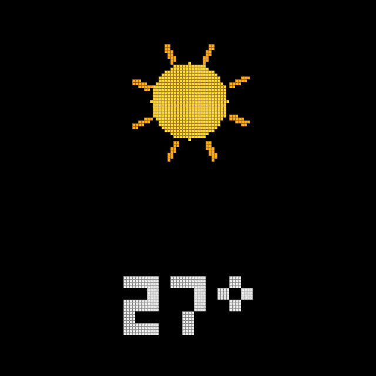
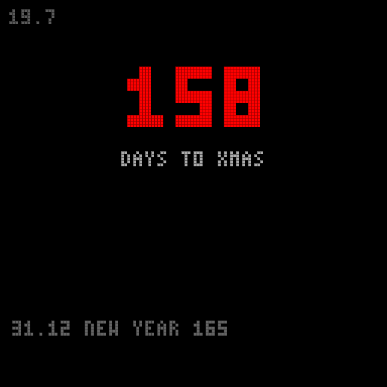
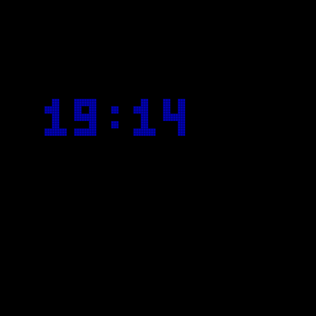
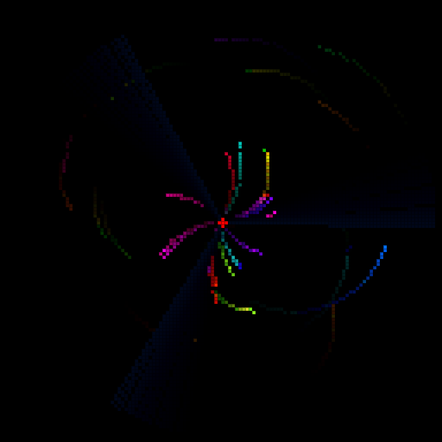
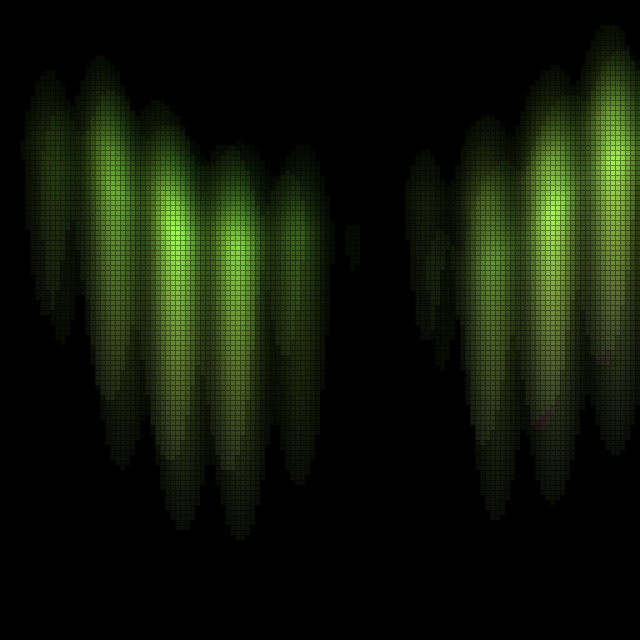
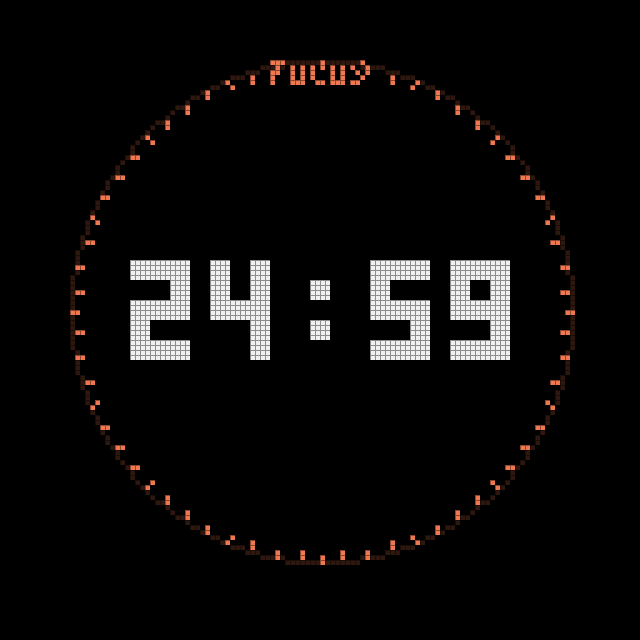
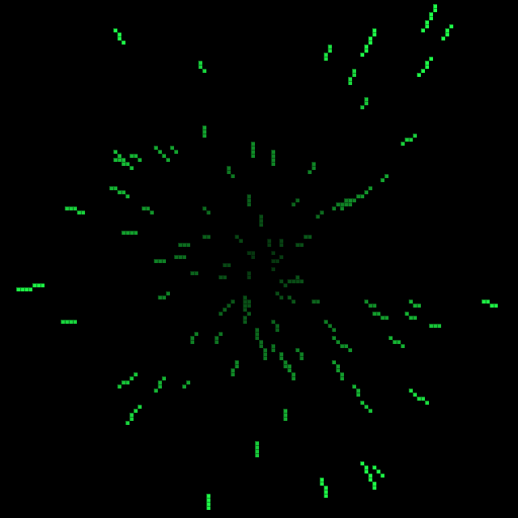
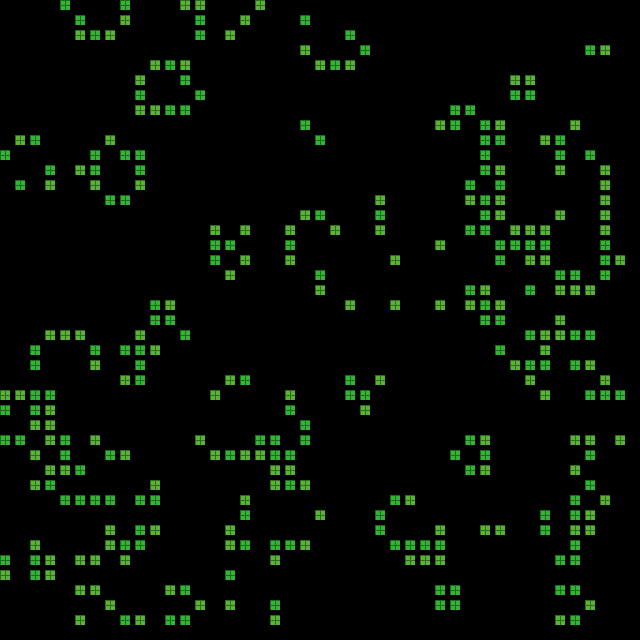
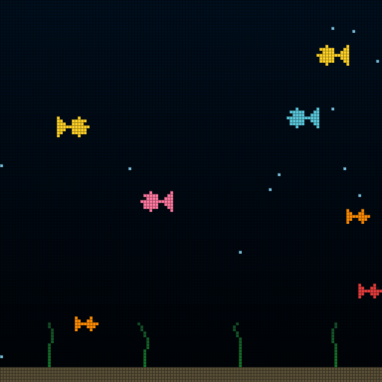

# Coriolis

LED matrix wall display — successor to [Borealis](https://github.com/cyanidesayonara/borealis)
(Aurora → Borealis → Coriolis). A 128×128 HUB75 panel driven by a Teensy 4.1:
a wall clock first, with ambient art, a guided-fitness suite, and games.

Developed entirely against a desktop simulator; the images below are captured
from it. See [PLAN.md](PLAN.md) for the hardware plan and the platform decision.

## Scenes

<table>
<tr>
<td align="center"><br>Digital clock</td>
<td align="center"><br>Analog clock</td>
<td align="center"><br>Word clock</td>
</tr>
<tr>
<td align="center"><br>Weather</td>
<td align="center"><br>Calendar</td>
<td align="center"><br>Bouncing clock</td>
</tr>
<tr>
<td align="center"><br>Spiro</td>
<td align="center"><br>Mandala</td>
<td align="center"><br>Coriolis</td>
</tr>
<tr>
<td align="center"><br>Digital rain</td>
<td align="center"><br>Fireplace</td>
<td align="center"><br>Aurora</td>
</tr>
<tr>
<td align="center"><br>Yoga</td>
<td align="center"><br>Exercise (kettlebell)</td>
<td align="center"><br>Breathe</td>
</tr>
<tr>
<td align="center"><br>Focus timer</td>
<td align="center"><br>Pong</td>
<td align="center"><br>Snake</td>
</tr>
<tr>
<td align="center"><br>Tetris</td>
<td align="center"><br>Starfield</td>
<td align="center"><br>Game of Life</td>
</tr>
<tr>
<td align="center"><br>Aquarium</td>
<td align="center"><br>Clock overlay</td>
</tr>
</table>

Any of the three clocks can also be shown as a movable, resizable **overlay**
on top of any other scene (the `C` button), just like Borealis.

## Architecture

Scenes (clock, patterns, games) draw into a plain framebuffer through a small
core API and never touch hardware. Backends copy that framebuffer to a real
output:

```
core/     framebuffer, color, 8-bit wave math, palettes, bitmap font, Scene API
scenes/   everything visible: clocks, guides, games, ambient art
sim/      desktop backend: raylib window, system clock, keyboard input
firmware/ hardware backend: Teensy 4.1 + SmartLED Shield V5 + SmartMatrix 4
```

The simulator is not a side tool — it's the primary development environment.
Scenes are written and tuned on the desktop; the hardware backend only
replaces the window with panels and the keyboard with a remote/gamepad.

The display is `128x128` square (the decided final form). A `128x64` widescreen
variant survives as a build flag (`-DWIDE=ON`) for experiments, so scenes stay
resolution-agnostic.

## Build and run the simulator

Prerequisites: CMake ≥ 3.16, a C++ compiler, git (raylib is fetched
automatically on first configure).

```sh
cmake -B build
cmake --build build
./build/coriolis_sim          # Windows: build\coriolis_sim.exe

# the widescreen 128x64 variant:
cmake -B build-wide -DWIDE=ON
cmake --build build-wide

# regenerate the README screenshots:
./build/coriolis_sim --shots docs/screenshots
```

## Controls (simulator)

| Key | Action |
|-----|--------|
| `SPACE` / `→` | next scene |
| `←` | previous scene |
| `↑` / `↓` | cycle palette (when the scene doesn't use them) |
| `S` | open/close settings — jumps to the current scene's section |
| `C` | cycle the clock overlay (off / digital / analog / word) |
| `BACKSPACE` | back: closes settings, otherwise home to the clock |
| `R` | rotate the display 90° |
| `ESC` | quit (saves settings) |

Each control maps to a button on the device's IR remote (`S` = menu, `C` =
the overlay button, arrows + OK + back). A USB gamepad is the optional
better input for the games.

Settings is not part of the scene rotation — only `S` reaches it (the
remote's menu button on the device). It is one scrolling list with
sections: GENERAL (brightness, palette, rotation, autoplay), OVERLAY (clock
type, position, size), then one per scene (yoga, exercise, breathe, pong,
snake, fireplace). Games are never themed; clocks and patterns follow the
palette; guides and the fireplace keep their own fixed look.

Guide scenes (`↑`/`↓` set the pace, `ENTER` pauses):
- **Yoga** holds poses; **Exercise** animates reps with a bodyweight or
  kettlebell program (settings); **Breathe** is box or 4-7-8.
- **Focus** is a Pomodoro timer: `↑`/`↓` set the work length, `ENTER` starts
  and pauses. Work and break phases count down big, with a draining ring and
  a tomato per finished session; every fourth break runs long.

Arrow keys are offered to the active scene first, matching how a
remote/gamepad will behave on the device. Scene-specific keys:

- **Pong**: `↑`/`↓` grab the left paddle (AI-vs-AI until you interfere),
  `ENTER` restarts the match.
- **Snake**: arrows steer; walls and your own tail are fatal; `ENTER`
  retries after game over. Your best length is kept and shown on the card.
- **Tetris**: `←`/`→` move, `↑` rotate, `↓` soft-drop, `ENTER` hard-drop;
  a landing shadow shows where the piece will fall. High score persists.
- **Yoga**: `ENTER` pauses, `↑`/`↓` shorten/lengthen the pose hold time.
- **Gifs**: `↑`/`↓` browse files. Drop `.gif` files into a `gifs/` folder
  next to the exe (`build/gifs/`).
- **Calendar**: fully offline countdowns — put an `events.txt` next to the
  exe with one yearly event per line (`24.12 Xmas`). The nearest event gets
  a big countdown, and fireworks on the day itself.
- **Weather**: an animated sky (sun, clouds, rain, snow, storm) with the
  temperature. Stays offline — drop a `weather.txt` next to the exe with one
  line (`clear 27`, `rain 14`) to feed it; without it, the scene waits.
- **Settings**: `↑`/`↓` pick a row, `←`/`→` adjust. Values apply live and
  persist to `coriolis_settings.txt` next to the exe (SD/EEPROM on the
  device later). Autoplay cycles scenes, skipping games in progress,
  activities, and the settings screen itself.

## Firmware (Teensy 4.1)

The device firmware in [`firmware/coriolis/`](firmware/coriolis/) runs the
same `core/` and `scenes/` unchanged, with device backends: the Teensy RTC
for time, EEPROM for settings, serial characters for bench input (IR remote
later), built-in holidays (SD later), and no weather until a UART feeder
pushes it. It compiles today — no hardware needed to keep it healthy:

```sh
# one-time toolchain (arduino-cli + Teensy platform + patched SmartMatrix 4):
winget install ArduinoSA.CLI
powershell -File firmware/setup.ps1

# build:
arduino-cli compile --fqbn teensy:avr:teensy41 firmware/coriolis
```

SmartMatrix 4.0.3 needs three tiny patches for the GCC 11 toolchain in
Teensyduino 1.62+ (COMDAT section conflicts and a FLASHMEM constructor
alias) — `setup.ps1` applies [`smartmatrix-gcc11.patch`](firmware/smartmatrix-gcc11.patch)
automatically. Flashing waits for the actual board and shield.

## Adding a scene

1. Create `scenes/scene_yourthing.h` implementing `coriolis::Scene`
   (`name()`, `draw(Context&)`, optionally `start/stop/input`).
2. Register an instance in the `scenes[]` array in `sim/main.cpp`.
3. `cmake --build build` and it's in the rotation.

`Context` hands a scene everything it may use: the framebuffer, the time
source, the active palette, and monotonic milliseconds. If a scene needs
something new (audio frames, weather data), extend `Context` with an
interface the backends can fake — never reach around it.
